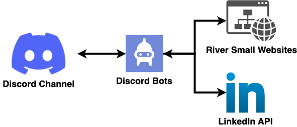

# Discord Jobs Information Bot
This project is designed to scrape job information and interact with a LinkedIn bot to provide job-related notifications and updates.

## Overview
The bot searches for job listings on LinkedIn based on provided job titles.
It also scrapes job information from a source, possibly named Riversmall.
The scraped data is processed, parsed, and then sent to a LinkedIn bot for updates.

## Main Components

* models.go: Defines the data structures or models used in the application.
* bots.go: Contains logic related to the bots or automation tasks.
* general_scrapper.go: Contains generic or abstract web scraping functionalities.
* scrapper.go: Implements specific scraping functionalities.
* main.go: The main entry point of the application.

## Dependencies
The project relies on several external Go packages:

* discordgo: For Discord interactions.
* colly: A web scraping framework.
* goquery: For querying HTML documents.
* antchfx packages: For HTML and XML document querying.
* sanitize: For sanitizing strings.
* And several utility packages from the Go team.
  
## Getting Started
* Clone the repository.
* Install the required dependencies using go mod tidy.
* Run the application using go run main.go.

* Note: Ensure you have the necessary API keys and credentials set up for the bot to function correctly.

License
This project is open-source, but the license details are not provided. Please consult the project owner for more information.

